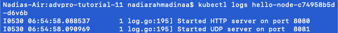

## Refleksi 1
### Compare the application logs before and after you exposed it as a Service. Try to open the app several times while the proxy into the Service is running. What do you see in the logs? Does the number of logs increase each time you open the app?

Sebelum expose sebagai service, logs hanya berisi inisialisasi dari server. Server juga tidak bisa diakses dari luar cluster. Jika service sedang mati, aplikasi tidak bisa kita lihat dari localhost sekalipun. Saat sedang menyala servicenya, maka akan tampak http requests yang masuk ke dalam logs. Logs akan terus meningkat setiap kali kita visit endpoint baru atau refresh aplikasi, karena logs akan bertambah seiring dengan request yang masuk.
Sebagai perbandingan berikut foto sebelum service menyala:

Dan berikut foto ketika service menyala dan diakses:

### Notice that there are two versions of `kubectl get` invocation during this tutorial section. The first does not have any option, while the latter has `-n` option with value set to `kube-system`. What is the purpose of the `-n` option and why did the output not list the pods/services that you explicitly created?

Dalam kubernetes `-n` menandakan namespace. Namespace ini biasanya digunakan untuk membagi resource ketika bekerja dengan banyak kelompok dengan tasks berbeda. Namespace bersifat unik dan tidak dapat di nest. Setiap resource hanya dapat masuk ke salah satu namespace (kecuali diduplikasi pada namespace lain). Ketika kita tidak spesifikasi namespace, atau tidak menggunakan flag `-n` akan diarahkan ke namespace default. Ketika saya membuat `hello-node`, saya tidak menspesifikasikan namespace sehingga akan masuk ke default. Hal inilah mengapa `hello-node` tidak muncul saat kita memanggil `-n kube-system`, karena beda namespace.