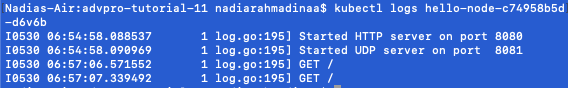

## Refleksi 1
### Compare the application logs before and after you exposed it as a Service. Try to open the app several times while the proxy into the Service is running. What do you see in the logs? Does the number of logs increase each time you open the app?

Sebelum expose sebagai service, logs hanya berisi inisialisasi dari server. Server juga tidak bisa diakses dari luar cluster. Jika service sedang mati, aplikasi tidak bisa kita lihat dari localhost sekalipun. Saat sedang menyala servicenya, maka akan tampak http requests yang masuk ke dalam logs. Logs akan terus meningkat setiap kali kita visit endpoint baru atau refresh aplikasi, karena logs akan bertambah seiring dengan request yang masuk.
Sebagai perbandingan berikut foto sebelum service menyala:

Dan berikut foto ketika service menyala dan diakses:

### Notice that there are two versions of `kubectl get` invocation during this tutorial section. The first does not have any option, while the latter has `-n` option with value set to `kube-system`. What is the purpose of the `-n` option and why did the output not list the pods/services that you explicitly created?

Dalam kubernetes `-n` menandakan namespace. Namespace ini biasanya digunakan untuk membagi resource ketika bekerja dengan banyak kelompok dengan tasks berbeda. Namespace bersifat unik dan tidak dapat di nest. Setiap resource hanya dapat masuk ke salah satu namespace (kecuali diduplikasi pada namespace lain). Ketika kita tidak spesifikasi namespace, atau tidak menggunakan flag `-n` akan diarahkan ke namespace default. Ketika saya membuat `hello-node`, saya tidak menspesifikasikan namespace sehingga akan masuk ke default. Hal inilah mengapa `hello-node` tidak muncul saat kita memanggil `-n kube-system`, karena beda namespace.

## Refleksi 2
### What is the difference between Rolling Update and Recreate deployment strategy?
Rolling update menggantikan pods lama dengan yang baru secara bertahap. Strategi ini tidak mengakibatkan downtime sama sekali. Cara kerjanya adalah dengan membuat pods baru sebelum menghentikan yang lama. Sedangakn recreate strategy menghentikan existing pods dahulu. Setelah itu, akan dibuat pods baru yang updated. Hal ini akan menyebabkan adanya downtime, namun metodologinya lebih simple.

### Try deploying the Spring Petclinic REST using Recreate deployment strategy and document your attempt.

Sebagai awalan, saya membuat deployment dengan metode yang sama seperti sebelumnya. Namun setelah berhasil, saya mengubah strategy menjadi recreate, dan set rolling update jadi null. Setelah itu, saya set replica menjadi 4 seperti deployment sebelumnya.

Kemudian, ini contoh ketika kita mengganti version dari docker image. Dapat terlihat bahwa keempat deployment terminate secara sekaligus on change.

Setelah terminate, kita tunggu sebentar dan mereka akan kembali running dalam waktu yang bersaman. Dalam gap waktu tersebut, deployment terhentikan dan memiliki downtime. Strategy ini kurang sesuai untuk deployment production pada suatu perusahaan atau aplikasi yang secara luas digunakan, karena pengguna akan complain atas downtime yang ada.

### Prepare different manifest files for executing Recreate deployment strategy.
Saya menggunakan command `kubectl get deployments/spring-petclinic-rest -o yaml > deployment-recreate.yaml` untuk membuat manifest file recreate. Terdapat perbedaan dari manifest deploymentnya, dimana `strategy: type: Recreate`. Pada manifest file yang awal, strategynya `strategy: rollingUpdate: maxSurge: 25% maxUnavailable: 25% type: RollingUpdate`. Dari perbedaan kedua baris ini, terlihat bahwa recreate cukup simple untuk diimplementasikan. Tidak ada perlu detail tambahan seperti maxSurge dan maxUnavailable, karena seluruh deployment akan terminate dan run dalam waktu yang bersamaan.

### What do you think are the benefits of using Kubernetes manifest files? Recall your experience in deploying the app manually and compare it to your experience when deploying the same app by applying the manifest files (i.e., invoking `kubectl apply -f` command) to the cluster.
Manifest files membantu kita setup service dan deployment lebih cepat. Tanpa manifest files, kita perlu melakukan satu-satu tahap seperti pull image, deploy, expose, setup replica dimana hal tersebut membutuhkan belasan bahkan puluhan command. Dengan files tersebut, kita hanya perlu 2 command untuk setup. Hal ini sangat bermanfaat apabila sudah ada anggota tim yang melakukan setup, dan ingin di distribusikan ke orang lain. Dengan demikian, mereka bisa membuat setup yang sama dengan waktu yang dipersingkat jauh. Manifest scripts seperti ini juga dapat bermanfaat untuk CI/CD pipeline sebagai setup yang cepat dan mudah.